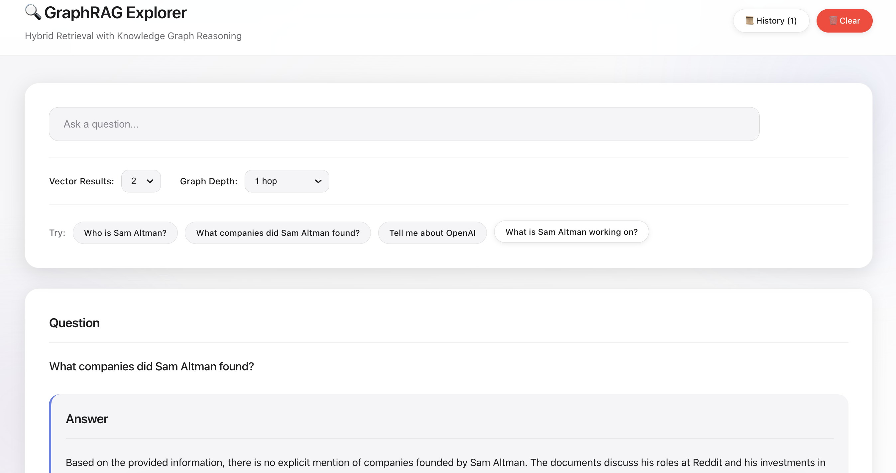

# 🔍 GraphRAG Explorer

> **Hybrid Retrieval-Augmented Generation with Knowledge Graph Reasoning**

A complete implementation of GraphRAG that combines **semantic vector search** with **knowledge graph traversal** to provide accurate, grounded answers with full provenance tracking.

---

## 📸 Screenshot

<!-- Add your UI screenshot here -->


---

## ⚠️ Performance Note

> **This project uses local LLMs (Ollama) for all AI operations including embeddings and text generation.**
> 
> Depending on your hardware, query responses may take **30-90 seconds**. This is expected behavior when running models like `qwen2.5:7b` locally. For faster performance, consider using a machine with a dedicated GPU or switching to cloud-based LLM APIs.

---

## 🎯 What is This?

Traditional RAG (Retrieval-Augmented Generation) retrieves text chunks based on semantic similarity alone. **GraphRAG** enhances this by:

1. **Extracting entities and relationships** from documents into a knowledge graph
2. **Linking graph nodes back to source text** for provenance
3. **Traversing the graph** during retrieval to find contextually related information
4. **Grounding answers** in both semantic matches AND graph-connected facts

This drastically reduces hallucinations and enables **multi-hop reasoning** (e.g., "What companies are connected to Sam Altman?" requires traversing multiple relationships).

---

## 🏗️ High-Level Architecture

```
┌─────────────────────────────────────────────────────────────────────────────┐
│                              GraphRAG Pipeline                               │
├─────────────────────────────────────────────────────────────────────────────┤
│                                                                              │
│   ┌──────────────┐     ┌──────────────┐     ┌──────────────────────────┐   │
│   │   PDF Docs   │────▶│   Chunking   │────▶│  Embedding (Ollama)       │   │
│   │  (Data/)     │     │  (500 tokens)│     │  nomic-embed-text         │   │
│   └──────────────┘     └──────────────┘     └────────────┬─────────────┘   │
│                                                           │                  │
│                              ┌────────────────────────────┴───────┐         │
│                              ▼                                    ▼         │
│                   ┌──────────────────┐              ┌──────────────────┐   │
│                   │   MongoDB Atlas  │              │  Entity Extraction│   │
│                   │   Vector Store   │              │  (Ollama LLM)     │   │
│                   │   173 chunks     │              └─────────┬────────┘   │
│                   └────────┬─────────┘                        │            │
│                            │                                  ▼            │
│                            │                        ┌──────────────────┐   │
│                            │                        │      Neo4j       │   │
│                            │                        │  Knowledge Graph │   │
│                            │                        │  35 nodes        │   │
│                            │                        │  27 relationships│   │
│                            │                        └─────────┬────────┘   │
│                            │                                  │            │
│                            └──────────────┬───────────────────┘            │
│                                           │                                 │
│                                           ▼                                 │
│                              ┌────────────────────────┐                    │
│                              │    Hybrid Retrieval    │                    │
│                              │  Vector + Graph Merge  │                    │
│                              └───────────┬────────────┘                    │
│                                          │                                  │
│                                          ▼                                  │
│                              ┌────────────────────────┐                    │
│                              │   Graph-Aware Prompt   │                    │
│                              │   + Answer Generation  │                    │
│                              └───────────┬────────────┘                    │
│                                          │                                  │
│                                          ▼                                  │
│                              ┌────────────────────────┐                    │
│                              │     React UI + API     │                    │
│                              │   Full Visualization   │                    │
│                              └────────────────────────┘                    │
│                                                                             │
└─────────────────────────────────────────────────────────────────────────────┘
```

---

## 🔄 The 10-Step Flow

| Step | Description | Output |
|------|-------------|--------|
| **0** | Prepare PDF documents | Source files in `data/` |
| **1** | Chunk documents (500 tokens, 50 overlap) | Text segments with metadata |
| **2** | Generate embeddings with Ollama | 768-dim vectors |
| **3** | Store vectors in MongoDB Atlas | Searchable vector index |
| **4** | Extract entities & relationships with LLM | Structured JSON |
| **5** | Store graph in Neo4j | Nodes + Relationships |
| **6** | Link graph nodes to source chunks | Bidirectional references |
| **7** | Hybrid retrieval (vector + graph) | Enriched context |
| **8** | Construct graph-aware prompt | Grounded instructions |
| **9** | Generate answer with provenance | Cited response |
| **10** | Visualize in React UI | Interactive exploration |

---

## 📄 Example Data Used

This project was developed and tested using Wikipedia PDFs about:

- **Sam Altman** - CEO of OpenAI, former president of Y Combinator
- Topics covering: OpenAI, Microsoft partnership, ChatGPT, AI development

These documents were chosen because they contain rich **interconnected entities** (people, companies, products, investments) that demonstrate the power of graph-based reasoning.

**Example Query Results:**
```
Query: "How is Sam Altman related to Microsoft?"

Answer: "Sam Altman is the CEO of OpenAI, which has a major 
        partnership with Microsoft. Microsoft has invested 
        billions in OpenAI and integrated its technology..."

Graph Paths Found:
  • Sam Altman → CEO_OF → OpenAI
  • OpenAI → PARTNERED_WITH → Microsoft  
  • Sam Altman → WORKS_ON → ChatGPT
  • ChatGPT → PRODUCT_OF → OpenAI

Citations:
  • Sam_Altman.pdf (Page 1, 14, 17)
```

---

## 🛠️ Tech Stack

| Component | Technology |
|-----------|------------|
| **Vector Database** | MongoDB Atlas (with Vector Search) |
| **Knowledge Graph** | Neo4j |
| **Embeddings** | Ollama (`nomic-embed-text`) |
| **LLM** | Ollama (`qwen2.5:7b`) |
| **Backend** | Node.js + Express |
| **Frontend** | React + Vite |
| **PDF Processing** | pdf.js-extract |

---

## 🚀 Quick Start

### Prerequisites

1. **Ollama** installed and running
   ```bash
   # Install models
   ollama pull nomic-embed-text
   ollama pull qwen2.5:7b
   ```

2. **MongoDB Atlas** account with:
   - Cluster created
   - Vector search index named `langgraph_vector_index`

3. **Neo4j** database (local or Aura)

### Installation

```bash
# Clone the repository
git clone <your-repo-url>
cd langgraph

# Install dependencies
npm install
cd ui && npm install && cd ..

# Configure environment
cp .env.example .env
# Edit .env with your credentials
```

### Environment Variables

```env
# MongoDB Atlas
MONGODB_URI=mongodb+srv://<user>:<pass>@cluster.mongodb.net/
MONGODB_DB_NAME=graphrag
MONGODB_COLLECTION=document_chunks

# Neo4j
NEO4J_URI=bolt://localhost:7687
NEO4J_USER=neo4j
NEO4J_PASSWORD=your-password

# Ollama (local)
OLLAMA_BASE_URL=http://localhost:11434
OLLAMA_EMBED_MODEL=nomic-embed-text
OLLAMA_LLM_MODEL=qwen2.5:7b
```

### Running the Pipeline

```bash
# Step 1: Ingest PDFs (one-time)
npm run ingest

# Step 2: Build knowledge graph (one-time)
npm run build-graph

# Step 3: Start API server
npm run api

# Step 4: Start UI (new terminal)
cd ui && npm run dev
```

Open http://localhost:5173 to explore!

---

## 📁 Project Structure

```
langgraph/
├── data/                       # PDF documents to process
├── src/
│   ├── database/
│   │   ├── mongodbClient.js    # Vector storage operations
│   │   └── neo4jClient.js      # Graph database operations
│   ├── extraction/
│   │   ├── entityExtractor.js  # LLM-based entity/relation extraction
│   │   └── extractionPipeline.js
│   ├── ingestion/
│   │   └── ingestPipeline.js   # PDF ingestion pipeline
│   ├── query/
│   │   └── queryEngine.js      # Main query orchestration
│   ├── retrieval/
│   │   ├── hybridRetrieval.js  # Vector + Graph retrieval
│   │   └── promptBuilder.js    # Graph-aware prompt construction
│   └── utils/
│       ├── pdfProcessor.js     # PDF parsing and chunking
│       └── embeddingGenerator.js # Ollama embedding wrapper
├── ui/                         # React frontend
│   ├── src/
│   │   ├── App.jsx
│   │   └── components/
│   │       ├── QueryForm.jsx
│   │       ├── AnswerDisplay.jsx
│   │       ├── GraphVisualization.jsx
│   │       ├── Citations.jsx
│   │       └── QueryHistory.jsx
├── api-server.js               # Express REST API
├── package.json
└── README.md
```

---

## 🔬 How Hybrid Retrieval Works

```
User Query: "What companies did Sam Altman found?"
                    │
                    ▼
    ┌───────────────────────────────┐
    │   1. Vector Search (MongoDB)  │
    │   Find top-K similar chunks   │
    └───────────────┬───────────────┘
                    │
                    ▼
    ┌───────────────────────────────┐
    │   2. Entity Extraction        │
    │   "Sam Altman" → Person       │
    └───────────────┬───────────────┘
                    │
                    ▼
    ┌───────────────────────────────┐
    │   3. Graph Traversal (Neo4j)  │
    │   Sam Altman ──FOUNDED──▶ ?   │
    │   Finds: Loopt, OpenAI, etc.  │
    └───────────────┬───────────────┘
                    │
                    ▼
    ┌───────────────────────────────┐
    │   4. Chunk Enrichment         │
    │   Get chunks linked to        │
    │   discovered graph nodes      │
    └───────────────┬───────────────┘
                    │
                    ▼
    ┌───────────────────────────────┐
    │   5. Merged Context           │
    │   2 vector + 7 graph = 9      │
    │   chunks with full provenance │
    └───────────────────────────────┘
```

---

## 📊 Sample Statistics

After processing sample documents:

| Metric | Value |
|--------|-------|
| Documents Processed | 1 PDF |
| Total Chunks | 173 |
| Graph Nodes | 35 |
| - Companies | 14 |
| - People | 13 |
| - Products | 4 |
| - Other | 4 |
| Relationships | 27 |
| Enrichment Ratio | 3.5x (vector → hybrid) |

---

## 🎨 UI Features

- **Clean, Apple-inspired design** with smooth animations
- **Query form** with adjustable parameters (vector count, graph depth)
- **Answer display** with confidence stats
- **Graph paths visualization** showing entity relationships
- **Citation tracking** with page numbers
- **Query history** with localStorage persistence
- **Example queries** for quick exploration

---

## 🤝 Why GraphRAG?

| Traditional RAG | GraphRAG |
|-----------------|----------|
| Semantic similarity only | Semantic + Structural |
| Single-hop retrieval | Multi-hop reasoning |
| No relationship awareness | Explicit relationships |
| Limited context | Enriched context |
| Hard to verify | Full provenance |

---

## 📝 License

MIT

---

## 🙏 Acknowledgments

- Built with [LangChain.js](https://js.langchain.com/)
- Powered by [Ollama](https://ollama.ai/) for local LLM inference
- Vector search by [MongoDB Atlas](https://www.mongodb.com/atlas)
- Graph storage by [Neo4j](https://neo4j.com/)

---

<p align="center">
  <strong>Built with ❤️ for better AI reasoning</strong>
</p>
